```mermaid
graph TD
    A[Frontend - Vue.js] -->|HTTP| B[NestJS API]
    A -->|WebSocket| C[Socket.IO]
    B --> D[Prisma ORM]
    D --> E[PostgreSQL]
    C -->|Pub/Sub| F[Redis]
    G[Phaser Game] --> C
    H[Auth Service] -->|OAuth2| I[42 API]
    B -->|Logs| J[Prometheus]
    J --> K[Grafana]

    style A fill:#42b883,stroke:#333
    style B fill:#e0234e,stroke:#333
    style C fill:#010101,stroke:#333
    style G fill:#e3aa4a,stroke:#333
```

# Transcendence: The Ultimate 42 Final Project 🌐🚀


[](https://www.42.fr/)
[](https://github.com/<your_username>/transcendence/blob/master/LICENSE)
[](https://hub.docker.com/r/<your_username>/transcendence)
[](https://nestjs.com/)
[](https://vuejs.org/)

A full-stack web application featuring real-time multiplayer Pong, social features, and secure authentication, implementing 42's final project requirements with modern technologies.

## Table of Contents 📖
- [Project Overview](#project-overview-)
- [Key Features](#key-features-)
- [Tech Stack](#tech-stack-)
- [Architecture](#architecture-)
- [Installation](#installation-)
- [Usage](#usage-)
- [API Documentation](#api-documentation-)
- [Development](#development-)
- [Testing](#testing-)
- [Deployment](#deployment-)
- [Contributing](#contributing-)
- [License](#license-)

## Project Overview 📝

Transcendence is the final project in the 42 School curriculum, challenging students to create a complete web application with:
- Real-time multiplayer Pong game
- User authentication and profile management
- Social features (friends, chat, leaderboards)
- RESTful API backend
- Modern responsive frontend
- Containerized deployment

This implementation meets all project requirements while showcasing industry best practices in full-stack development.

## Key Features ✨

### 🎮 Game System
- **Real-time Pong** with Phaser.js physics engine
- **Multiplayer matchmaking** with ELO ranking system
- **Customizable paddles** and game settings
- **Tournament mode** with brackets
- **Spectator mode** for live matches

### 👥 Social Features
- Friend system with request management
- Direct and group messaging
- User status indicators (online/offline/in-game)
- Blocking system and moderation tools
- Achievement system with unlockable cosmetics

### 🔒 Authentication & Security
- 42 OAuth2 integration
- JWT authentication with refresh tokens
- Two-factor authentication (2FA)
- Rate limiting and request validation
- Password strength enforcement

### 📊 Dashboard
- Player statistics and match history
- Leaderboard with global rankings
- Notification system
- User profile customization
- Dark/light mode theming

## Tech Stack 💻

### Backend
| Technology | Purpose | Version |
|------------|---------|---------|
| NestJS | Framework | v10 |
| TypeScript | Language | 5.0+ |
| PostgreSQL | Database | 15+ |
| Prisma | ORM | 5.0+ |
| Passport.js | Authentication | v0.6 |
| Socket.IO | Real-time communication | v4.7+ |
| Swagger | API Documentation | v7.0+ |
| Redis | Caching & Pub/Sub | 7.0+ |

### Frontend
| Technology | Purpose | Version |
|------------|---------|---------|
| Vue.js 3 | Framework | 3.3+ |
| Vite | Build Tool | 4.0+ |
| Pinia | State Management | 2.1+ |
| Vue Router | Routing | 4.2+ |
| Tailwind CSS | Styling | 3.3+ |
| Bulma | UI Components | 0.9+ |
| Phaser.js | Game Engine | 3.60+ |
| Vee-Validate | Form Handling | 4.10+ |
| Socket.IO Client | Real-time | v4.7+ |

### Infrastructure
| Technology | Purpose |
|------------|---------|
| Docker | Containerization |
| Docker Compose | Orchestration |
| Nginx | Reverse Proxy |
| GitHub Actions | CI/CD |
| Prometheus | Monitoring |
| Grafana | Visualization |

## Architecture 🏗️



## Installation ⚙️

### Prerequisites
- Docker 20.10+
- Docker Compose 2.0+
- Node.js 18+

### Quick Start with Docker
```bash
# Clone repository
git clone https://github.com/<your_username>/transcendence.git
cd transcendence

# Copy environment template
cp .env.example .env

# Build and start containers
docker compose up -d --build

# Apply database migrations
docker compose exec api npx prisma migrate dev

# Visit application
open http://localhost:3000
```

### Manual Installation
```bash
# Backend setup
cd api
npm install
npx prisma generate
npx prisma migrate dev
npm run start:dev

# Frontend setup
cd ../frontend
npm install
npm run dev
```

## Usage 💻

### Application Access
- Frontend: `http://localhost:3000`
- API: `http://localhost:3001`
- Swagger Docs: `http://localhost:3001/api`
- PGAdmin: `http://localhost:5050` (admin@example.com / admin)
- Grafana: `http://localhost:3002` (admin / admin)

### First-Time Setup
1. Login with 42 OAuth credentials
2. Complete profile setup
3. Enable two-factor authentication (recommended)
4. Customize profile avatar and settings
5. Add friends using search feature
6. Challenge friends to a Pong match

### Game Controls
| Control | Action |
|---------|--------|
| **W/S** | Move paddle up/down |
| **Mouse** | Position paddle |
| **Space** | Serve ball |
| **ESC** | Pause menu |

## API Documentation 📚

The API is fully documented with Swagger UI:


Key API endpoints:
- `POST /auth/login` - 42 OAuth authentication
- `GET /users/me` - Get current user profile
- `POST /friends/request` - Send friend request
- `GET /game/matches` - List recent matches
- `WS /game` - Real-time game events

Run the API and visit `/api` to explore interactive documentation.

## Development 🛠️

### Project Structure
```
transcendence/
├── api/                  # NestJS backend
│   ├── src/
│   │   ├── auth/         # Authentication module
│   │   ├── game/         # Game logic and matchmaking
│   │   ├── users/        # User management
│   │   ├── chat/         # Chat functionality
│   │   └── prisma/       # Database schema
├── frontend/             # Vue.js application
│   ├── src/
│   │   ├── assets/       # Static assets
│   │   ├── components/   # Vue components
│   │   ├── game/         # Phaser game implementation
│   │   ├── router/       # Vue router config
│   │   └── stores/       # Pinia state management
├── docker/               # Docker configurations
├── .github/              # CI/CD workflows
└── docker-compose.yml    # Service orchestration
```

### Workflow Commands
```bash
# Start development servers
docker compose -f docker-compose.dev.yml up

# Run backend tests
docker compose exec api npm run test

# Run frontend tests
docker compose exec frontend npm run test

# Generate Prisma client
docker compose exec api npx prisma generate

# Apply database migrations
docker compose exec api npx prisma migrate dev

# Monitor application logs
docker compose logs -f
```

## Testing 🧪

### Test Suite
| Test Type | Tools | Coverage |
|----------|-------|----------|
| Unit | Jest, Vitest | > 80% |
| Integration | Supertest | > 70% |
| E2E | Cypress | > 60% |
| Load | k6 | > 50% |

### Running Tests
```bash
# Backend tests
cd api
npm test

# Frontend tests
cd ../frontend
npm test

# E2E tests (requires running app)
npm run test:e2e

# Generate coverage reports
npm run coverage
```

## Deployment 🚀

### Production Setup
```bash
docker compose -f docker-compose.prod.yml up -d --build
```

### Environment Variables
```env
# Backend
DATABASE_URL="postgresql://user:password@db:5432/transcendence"
JWT_SECRET="your_secure_secret"
API_PORT=3001
CLIENT_URL="http://localhost:3000"
FT_CLIENT_ID="your_42_uid"
FT_CLIENT_SECRET="your_42_secret"
REDIS_URL="redis://redis:6379"

# Frontend
VITE_API_URL="http://localhost:3001"
VITE_SOCKET_URL="ws://localhost:3001"
```

### Deployment Options
1. **Cloud Providers**:
   - AWS ECS/EKS
   - Google Cloud Run
   - Azure Container Instances

2. **CI/CD Pipeline** (GitHub Actions):
   ```yaml
   name: Deploy Production
   on:
     push:
       branches: [main]
   jobs:
     deploy:
       runs-on: ubuntu-latest
       steps:
         - name: Checkout
           uses: actions/checkout@v4
         - name: Docker Build
           run: docker compose -f docker-compose.prod.yml build
         - name: Deploy to AWS
           uses: aws-actions/configure-aws-credentials@v4
           with:
             aws-access-key-id: ${{ secrets.AWS_ACCESS_KEY_ID }}
             aws-secret-access-key: ${{ secrets.AWS_SECRET_ACCESS_KEY }}
             aws-region: eu-west-1
   ```

## Contributing 🤝

We welcome contributions! Please follow these steps:

1. Fork the repository
2. Create your feature branch (`git checkout -b feature/amazing-feature`)
3. Commit your changes (`git commit -m 'Add some amazing feature'`)
4. Push to the branch (`git push origin feature/amazing-feature`)
5. Open a pull request

### Coding Standards
- Follow NestJS best practices
- Adhere to Vue composition API style
- Use TypeScript strict mode
- Maintain 80%+ test coverage
- Follow Gitflow workflow

## License 📄

This project is licensed under the MIT License - see the [LICENSE](LICENSE) file for details.

---

🚀 **Transcend the Ordinary!**  
[](https://profile.intra.42.fr/users/<your_42_login>)  
[](https://github.com/<your_username>)

**Replace Placeholders**:  
1. `<your_username>` → Your GitHub handle  
2. `<your_42_login>` → Your 42 intra login  
3. Add application screenshots to `images/` directory  
4. Update environment variables with your actual credentials  
5. Add deployment-specific configurations as needed


#Team
[**ggiannit**](https://github.com/skyheis)
[**ocastell**](https://github.com/TheJocker94)
[**mgirardi**](https://github.com/mik989)
[**lpincoli**](https://github.com/lpincoli)
